# aria-arm64-bridge

[](https://github.com/robertteleng/aria-arm64-bridge/actions/workflows/tests.yml) [](LICENSE)

**Live Meta Aria glasses streaming on a Jetson (ARM64), from before Meta shipped ARM64 wheels.**

> **Status: archived experiment (February–August 2026).** Meta's `projectaria-client-sdk` 2.5.0
> (2026-09-04) ships native Linux aarch64 wheels, so the emulation layer at the core of this repo is
> no longer needed. What stays useful is the wire protocol, the zero-copy C++ consumer, the mock
> receiver, and **what was measured along the way**: [docs/FINDINGS.md](docs/FINDINGS.md).

## The problem it solved

The Aria **Client SDK** (connect, control, live streaming) was closed source and shipped only Linux
x86_64 wheels. On a Jetson Orin Nano there was no way to run it. This bridge runs the SDK under
[FEX-Emu](https://fex-emu.com) binary translation, with a hard split:

- the **emulated** process does I/O only: it receives frames from the SDK and pushes them over ZMQ;
- **everything that computes stays native**: CUDA, TensorRT, the models.

The split is not optional: **CUDA does not work under emulation.**

```mermaid
flowchart LR
    subgraph glasses["Aria Glasses (Gen1)"]
        cams["RGB 1408x1408
        SLAM L+R 640x480
        Eye IR 640x240
        IMU · Mag · Baro"]
    end

    cams -- "DDS over WiFi
    or USB-NCM" --> rcv

    subgraph jetson["Jetson Orin Nano (ARM64, JetPack 6.x)"]
        subgraph fex["FEX-Emu — x86_64 emulated, I/O only"]
            rcv["aria_arm64_bridge.receiver
            projectaria-client-sdk"]
        end

        rcv -- "ZMQ PUSH/PULL
        tcp://127.0.0.1:5555
        raw bytes" --> obs

        subgraph native["Native ARM64 — all the compute"]
            obs["AriaBridgeObserver (Python)
            or libariabridge (C++20)"]
            obs --> app["Your code
            e.g. YOLO · depth · gaze on TensorRT"]
        end
    end

    style fex fill:#2a2040,stroke:#7a5fbf
    style native fill:#1a3320,stroke:#4caf50
```



## What was learned

Full write-up with every measurement: [docs/FINDINGS.md](docs/FINDINGS.md).

- **A hypothesis that was right about the code and wrong about the cause.**
  - **The symptom:** SLAM decayed from 10 to 0.8 FPS.
  - **The first suspect:** SDK callbacks sharing one lock and sending 6 MB frames inside it. Fixing
    that was correct, but SLAM still collapsed.
  - **The real cause:** a degraded USB-NCM link. Its ping went from 4 ms healthy to 29 ms with 16 ms
    jitter.
  - **FEX-Emu was ruled out with numbers:** callbacks returned in 3.8 ms (p50).
- **WiFi beats USB.** Over 120-second runs per profile, `profile9` held RGB at 20 FPS, while USB
  collapsed SLAM with six streams. The high-RGB profiles looked best in short runs and degraded after
  a minute.
- **The downstream pipeline was input-bound.** The GPU averaged ~18 % utilization, so a faster model
  would not have helped.

## Wire protocol (v2.1)

One PUSH socket carries two message kinds, each a `[header, payload]` multipart. Sends are
non-blocking with drop-on-backpressure (high-water mark 64): a slow consumer costs frames, never
blocks the SDK threads.

```mermaid
sequenceDiagram
    participant SDK as Aria SDK (FEX)<br/>one thread per data type
    participant RX as Receiver (FEX)
    participant Q as ZMQ PUSH<br/>HWM 64, NOBLOCK
    participant OBS as AriaBridgeObserver<br/>(native ARM64)

    SDK->>RX: on_image_received(image, record)
    RX->>Q: enqueue [ARI2 header 28 B | raw pixels]<br/>cam_id, timestamp_ns, w, h, ch
    Note over RX,Q: callbacks only copy + put_nowait();<br/>one zmq-sender thread owns the socket

    SDK->>RX: on_imu_received(batch)
    RX->>Q: [ARS1 header 12 B | packed samples]

    Q->>OBS: recv_multipart()
    OBS->>OBS: rot90 + BGR + contiguous (one copy)
    OBS-->>OBS: get_frame("rgb") → read-only view
```

Camera IDs: `0=rgb, 1=eye, 2=slam1 (left), 3=slam2 (right)`. Sensor IDs: `0=imu1, 1=imu2, 2=mag, 3=baro`.
A consumer that only understands `ARI2` skips `ARS1` messages safely.

## Try it without glasses

The mock receiver sends synthetic frames over the real protocol, so a consumer can be exercised
with no glasses, no Jetson and no FEX-Emu:

```bash
git clone https://github.com/robertteleng/aria-arm64-bridge.git
cd aria-arm64-bridge
uv sync --group dev

uv run aria-bridge-mock &                    # synthetic frames on tcp://127.0.0.1:5555
uv run python examples/frame_consumer.py     # native consumer, prints FPS per camera
uv run pytest                                # 58 tests, no hardware

# C++20 consumer (fetches and builds libzmq if not installed)
cmake -S src/libariabridge -B build/cpp && cmake --build build/cpp && build/cpp/ariabridge_tests --unit
```

## Running it on a Jetson (as it ran)

Prerequisites:
- a Jetson with JetPack 6.x;
- FEX-Emu with an x86_64 rootfs holding `projectaria-client-sdk` (`scripts/setup_fex_emu.sh`,
  `scripts/setup_rootfs.sh`);
- glasses paired with `aria auth pair`.

The connection guide, in Spanish, is in [docs/ARIA_CONNECTION_GUIDE.md](docs/ARIA_CONNECTION_GUIDE.md).

```python
from aria_arm64_bridge import AriaBridge

with AriaBridge(interface="wifi", device_ip="<glasses-ip>") as bridge:
    while bridge.is_running:
        frame = bridge.get_frame("rgb")   # numpy BGR uint8, or None
        if frame is not None:
            your_model(frame)
```

Or run the receiver and the consumer as separate processes:

```bash
# FEX-Emu receiver
PYTHONNOUSERSITE=1 FEXBash -c "/usr/bin/python3 -m aria_arm64_bridge.receiver \
    --interface wifi --device-ip <glasses-ip> --profile profile9 --streams rgb,eye,imu"
```

```python
from aria_arm64_bridge import AriaBridgeObserver

observer = AriaBridgeObserver()        # connects to tcp://127.0.0.1:5555
frame = observer.get_frame("rgb")
sensors = observer.get_sensors()       # {"imu1": [...], "mag": (...), "baro": (...), "fps": {...}}
```

### Streams

| Stream | ID | Resolution | Notes |
|---|---|---|---|
| `rgb` | 0 | 1408×1408 | Main camera |
| `slam1` / `slam2` | 2 / 3 | 640×480 | Grayscale fisheye stereo pair (left / right) |
| `eye` | 1 | 640×240 | IR eye-tracking camera |
| `imu` | — | — | Accelerometer + gyroscope, batched |
| `mag`, `baro` | — | — | Magnetometer, barometer + temperature |

Rates depend on the streaming profile: see the profile table in [FINDINGS](docs/FINDINGS.md#3-transport-and-profiles-wifi-beats-usb-audit-2026-06-30).

### Hard-won rules

- **Use WiFi for multi-stream**; the USB-NCM link saturates with six streams.
- **Subscribe only to the streams you use**: every extra stream costs RGB frames.
- **Never subscribe to audio under FEX-Emu**: it crashes with `free(): invalid size`.
- **Always use `PYTHONNOUSERSITE=1`** and an explicit `/usr/bin/python3` under `FEXBash`.
- **A receiver killed mid-stream leaves the session open** (error 940). The receiver self-heals once;
  `scripts/stop_streaming.py` recovers manually.
- `get_frame()` returns a read-only view. Use `get_frame_if_new(camera, version)` in tight loops.

`scripts/launch_pipeline.sh` is the reference integration with
[aria-guard](https://github.com/robertteleng/aria-guard) (detection, depth, gaze and a dashboard in
Docker), kept as it ran on the device.

## Layout

```
src/aria_arm64_bridge/
├── bridge.py          # AriaBridge: manages the FEX receiver subprocess + observer
├── observer.py        # AriaBridgeObserver: native ZMQ consumer
├── receiver.py        # Aria SDK receiver (runs under FEX-Emu, x86_64)
├── mock_receiver.py   # Synthetic frame source: no glasses needed
├── protocol.py        # Wire protocol constants and sensor pack/unpack
├── telemetry.py       # Optional CPU/RAM/GPU/FPS CSV logger   [telemetry]
└── dashboard/         # Optional live web dashboard           [dashboard]
src/libariabridge/     # Native C++20 consumer: header-only protocol, zero-copy views
examples/              # Standalone consumers
scripts/               # FEX-Emu setup, profiling and audit scripts used on device
docs/                  # FINDINGS, connection guide, research notes
tests/                 # pytest (58, no hardware)
```

## Related

- [projectaria-client-sdk](https://pypi.org/project/projectaria-client-sdk/): 2.5.0 adds native Linux aarch64 wheels
- [projectaria-tools](https://pypi.org/project/projectaria-tools/): offline toolkit, native on aarch64 since 2.2.0
- [FEX-Emu](https://github.com/FEX-Emu/FEX): x86_64 binary translator for ARM64
- [aria-guard](https://github.com/robertteleng/aria-guard): the assistive navigation system this bridge fed

## License

[MIT](LICENSE). The Aria Client SDK and FEX-Emu are not included; the setup scripts install them from
their official sources under their own licenses.
